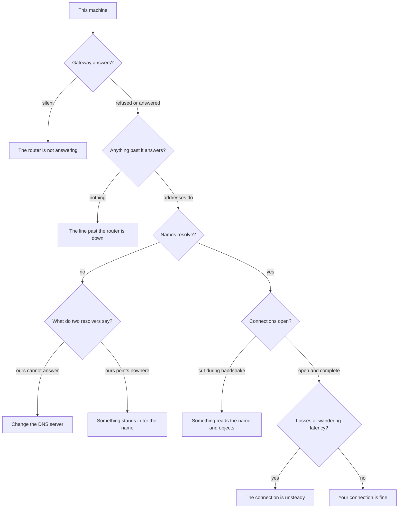
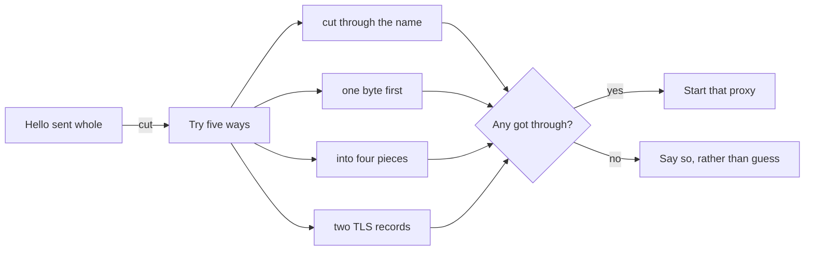

# netcheck

Your page will not open. Is it you, your router, your provider, the site, or somebody
in between deciding you should not see it?

This answers that, in a sentence, and shows the measurements the sentence rests on.

```
npm install
npm run dev:api     # http://localhost:3001
npm run dev:web     # http://localhost:5173
```

No database server, no container, no account. It writes one file beside itself and
that is the whole of its footprint.

## How it decides

Every check is one layer of the same chain. The verdict is a statement about where
the chain stops.



Two of those branches are worth spelling out, because no ordinary speed test makes
the distinction and the difference decides what a person should do next.

**A refusal is an answer.** A gateway that refuses a connection has received the
packet and replied to it, which proves the box is alive. Only silence leaves the
question open. That is what separates a dead router from a dead provider.

**A name that resolves is not a name you can reach.** If the lookup works and the
connection still fails, changing the DNS server will not help — and that is precisely
the advice a person would otherwise be given and waste an evening on.

## What it measures

| | |
|---|---|
| Reachability | one TCP connection per attempt, timed; loss and jitter from the spread |
| The nearest hop | the gateway, to tell your equipment from your provider's |
| Names | the same name asked of your resolver and a public one, side by side |
| Certificates | who signed them: a matching name with an unexpected issuer is interception |
| The path | where along the way the packets stop, hop by hop |
| Packet size | the largest that crosses whole, which is why pages open and large files stall |
| IPv6 | whether an address the machine holds actually leads anywhere |
| Speed | four streams, warmed up, measured against a content network |
| Devices | who else is on this network, out of the table the system already keeps |

Every check keeps its history, so a line that drops for a minute every evening — the
case that is invisible in a single reading, and the one people argue with providers
about — shows up as a trace rather than a number.

## Getting past a block

It can tell you whether a block is one that a different way of writing the handshake
gets past, and then be that way.



The last of those is not packet splitting at all: the handshake is carried in two TLS
records of its own, which the protocol allows and a server reassembles, while a filter
expecting one record per handshake sees only the first.

### Ready-made settings

Zapret ships a folder of these called ALT, ALT2, ALT13 and so on, and a person tries
them in turn without being told what any of them does. The ones here say what they do
and are ordered by what they cost, so the list reads as an order to try rather than a
menu to guess from — and the check above names the one to reach for, so usually there
is nothing to guess at all.

Starting one sets the system proxy for this user, so the browser and most other
programs are covered without any of them being set up by hand. Only the hosts that
needed help go through it; the rest goes straight out and never touches this. Nothing
asks for administrator rights, and stopping puts the setting back as it was.

Names going through the proxy are looked up over HTTPS. Splitting the write answers a
filter reading the name out of a packet; resolving over HTTPS answers a resolver
handing back somebody else's address. Separate blocks, separate answers.

### From a phone

Asked for by name, the proxies listen where the rest of the network can reach them and
the address for the phone's Wi-Fi settings is shown. Everybody else on that network can
route through it while that is on, which the app says plainly and which is why it is
off by default. Only addresses inside a home network are offered: a public one would
mean the proxy is open to the whole internet rather than to the flat.

### Every packet, whatever the program

That means standing between the network card and the whole machine, which on Windows
means WinDivert: a signed driver, loaded as a service, needing administrator rights.

The arithmetic for it is in `apps/api/src/divert` and is tested byte by byte — a
packet cut in two has to become two whole packets, each with its own lengths, its own
sequence number and its own checksums, or every hop discards both and the connection
dies rather than gets through.

```
npm run check:divert    # are the files there, are the rights there
npm run divert          # watch it cut handshakes on a live connection
```

The driver is not shipped here. It belongs to its author, and installing something
that runs inside the kernel is a decision to make with open eyes rather than to find
already made.

## What leaves this machine

A promise about privacy written in prose goes stale the first time somebody adds a
call, so the list is built from the same values the code uses and shown in the app
under **What leaves this machine**.

- The targets you chose to watch.
- One public resolver, to compare answers against your own.
- A content network, and only while a speed measurement is running.
- The release page, and only if you ask whether a newer version exists.

No telemetry, no analytics, no account. Nothing is uploaded: the history is a file on
your disk. Your location is never asked for. Nothing is read about the pages you
visit or what your traffic contains — the proxy relays bytes without looking at them
and holds no key to any of it.

The report you can hand to a provider carries host names, timings and verdicts, and
says so at the bottom. Devices on your network are counted in it, never named.

## Layout

```
apps/api/src/
    probe/      one TCP connection per attempt, timed
    verdict/    turns results into a named cause
    route/      gateway, traceroute, neighbours, IPv6
    dns/        two resolvers compared; lookups over HTTPS
    tls/        handshakes, certificates, who cut the connection
    mtu/        the largest packet the path carries whole
    proxy/      the ways of writing a hello, and the proxies that do
    divert/     packet arithmetic for the driver path
    speed/      the measurement and its maths
    report/     plain text for somebody who will never open this
    db/         SQLite, migrations, the repository
    http/       routes, and what the last checks found
apps/web/src/
    App.tsx     the page
    words.ts    every string, in both languages
    trace.ts    history into a line
tools/          binary build, driver checks
```

## Where the time goes

Reading the page is two tenths of a millisecond against a month of history, because
every question a page asks is answered down an index rather than by ranking a table.
The sweep that keeps the file small used to cost thirty times everything else put
together: it asked which samples belonged to an old check by building a list of every
run id in the window, tens of thousands of them, to find twenty rows. Ids rise with
the clock, so that question has an answer that is a boundary rather than a list.

```
latestStatus   0.09 ms     prune   8.35 ms  ->  0.37 ms
history        0.20 ms
```

## Rules the code keeps

Things that are true have tests. Things that are unproven say so in the file: the
bridge to the driver can only run where the driver is, and that is not where it was
written.

Where a check cannot tell, it says it cannot tell rather than picking the likelier
answer. A tool that guesses confidently is worse than one that admits a gap, because
the guess is what a person acts on.

```
npm test          # 601 tests
npm run typecheck
```

Most of those are unit tests on things that can be decided without a network: what a
verdict means, where a packet is cut, which resolver answered. Above them sit tests
that drive the HTTP layer, and above those a smoke test that boots a real server on a
real port and walks it as a person would.

That last layer exists because every route passing on its own was not enough: a report
that never learned about two later checks, a headline with nothing to show for a cause
somebody added, a page gone blank on an answer that arrived short — each was found by
hand, and a thing found by hand twice belongs in the suite.

Both languages are compared against each other in tests: a cause added to the verdict
without a line to show for it would print an empty headline, in whichever language the
reader happens to have.
